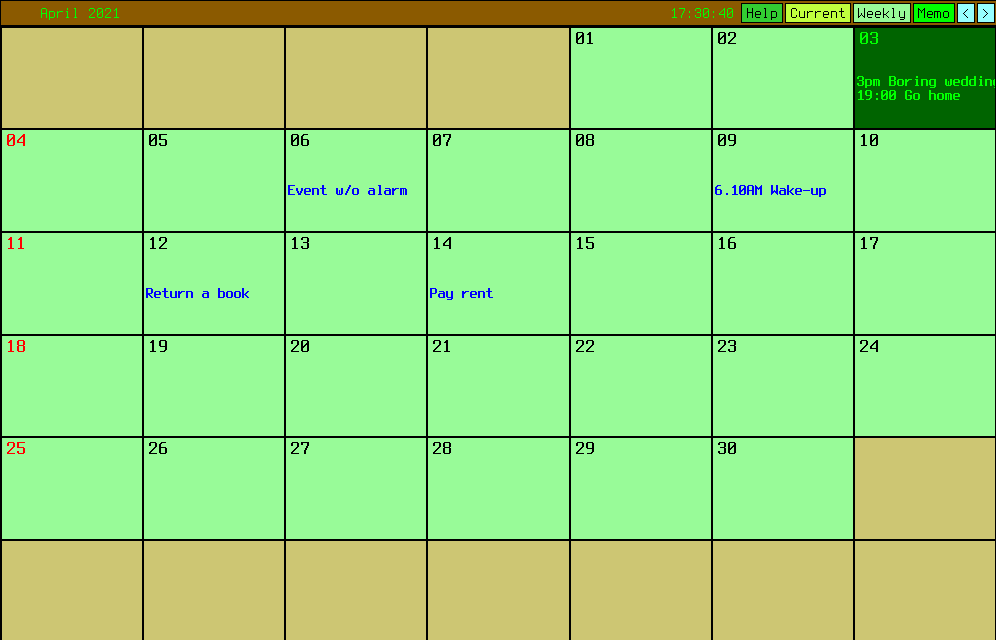

# Xcalim: Simple calendar with alarms for the X Window System

Xcalim is a very customizable calendar program made with the
[X Athena Widgets library][1]. It stems from Xcal, from Peter Collinson.¹
Features include:

- Alarms

- No need for the mouse, we have keyboard navigation

- Grid calendar view (instead of Xcal's strip)

- Daemon mode

### Overview

Events can start with
time stamps, which are used to trigger alarms (if activated). For example,

    18:10 John Doe's wedding

triggers that alarm at 18:10. Variations such as 1810, 18.10, 610pm 0610PM, etc. also work.
Additional alarms may be set, say, 5 min in advance of each event.

It can run as a `-daemon`, i.e., without spawning a initial window, 
which is useful to monitor and issue alarms without the need to keep a window open.

### Installation

Clone the repository, enter its directory, make and install.

    git clone https://github.com/qsmodo/xcalim
    cd xcalim
    xmkmf && make Makefiles && make derived && make depend && make && sudo make install

Dependencies include Libxaw, Libxmu and, for building, Xmkmf (`xutils-dev` package
in Debian).

### Auxiliary programs

The original Xcal (which can be found [in Debian repositories][2]) was bundled with several 
auxiliar programs. I'm also distributing them
here. See `README.contents` and their manpages for more details on what they do.

### Similar software worth considering:

**[Plan][3]**

A truly amazing Motif calendar with day, week, month and year views. Very advanced
alarm handling and interface. I really like it,
but it would occasionally skip alarms in my tests, and this is definetly a no-go
for me, and I failed to track it down. Unfortunately, it encodes files in ISO-8859, 
not UTF-8. The appointments file structure is quite complicated and undocumented,
for users are not supposed to manage them by hand. Keyboard navigation is likewise
restricted, mouse is relied upon very much.

**[Ical][4]**

This one is Tk based. Also very good, but not so powerful as Plan.
Cannot rely solely on keyboard either.

### Notes
1: I would keep the name Xcal but it clashes with various unrelated software.
Xcalim, on the other hand, seems unused.  
2: There is some leftover code from Xcal laying around. I'll try to remove it as
I go.

[1]: https://en.wikipedia.org/wiki/X_Athena_Widgets
[2]: https://packages.debian.org/buster/xcal
[3]: https://www.bitrot.de/plan.html
[4]: https://en.wikipedia.org/wiki/Ical_(Unix)
